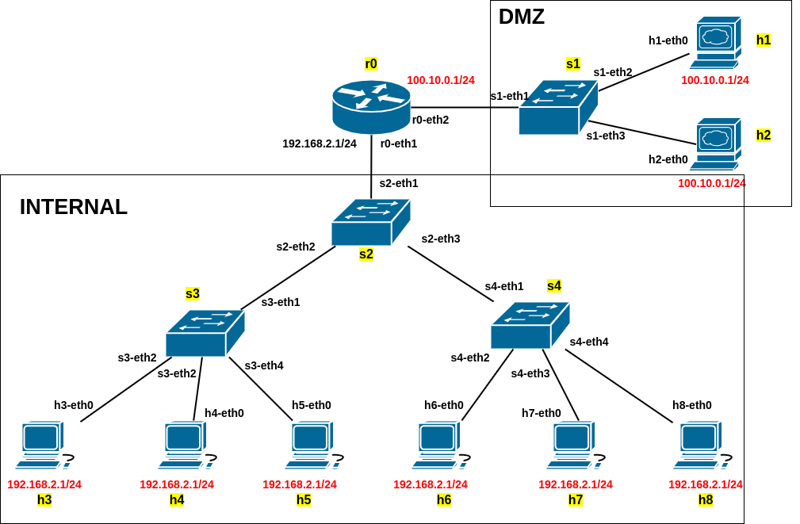
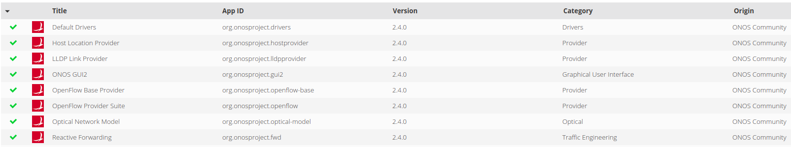
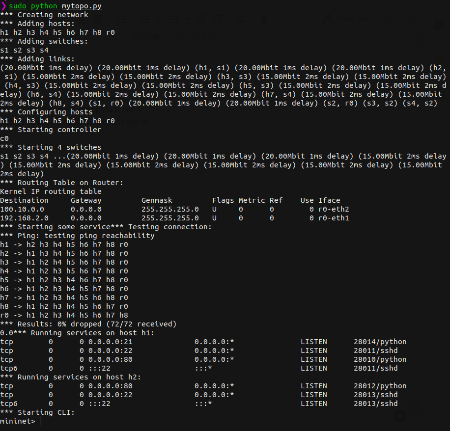
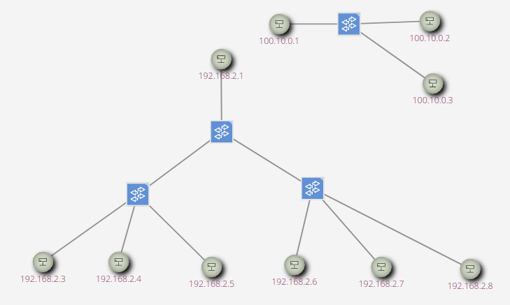

# kdd99_ids
kdd99 dataset analyzing and some experiments to reproduce data collecting.
## Table of contents:
- [KDD99 dataset](#kdd99-dataset)  
- [Reproduce data collecting](#reproduce-data-collecting)
  - [Step 1: Simulated SDN environment using Mininet and ONOS](#step-1)
  - [Step 2: Simulated attack, collect raw tcp dump data](#step-2)
  - [Step 3: Process raw tcp dump data](#step-3)
- [More detail](#more-details)
---
## KDD99 dataset
Quote from [KDD99 homepage](http://kdd.ics.uci.edu/databases/kddcup99/kddcup99.html):
>This is the data set used for The Third International Knowledge Discovery and Data Mining Tools Competition, which was held in conjunction with KDD-99 The Fifth International Conference on Knowledge Discovery and Data Mining. The competition task was to build a network intrusion detector, a predictive model capable of distinguishing between *bad* connections, called intrusions or attacks, and *good* normal connections. This database contains a standard set of data to be audited, which includes a wide variety of intrusions simulated in a military network environment.

More:
- [On OpenML](https://www.openml.org/d/1113)
- [On Kaggle](https://www.kaggle.com/galaxyh/kdd-cup-1999-data)

Some basic analyzing about KDD99 dataset can be found at [kdd99.ipynb](kdd99.ipynb)

## Reproduce data collecting
This [kdd99_feature_extractor](https://github.com/AI-IDS/kdd99_feature_extractor) repository contain a lot of helpful information about kdd99 data reproducing. This tool will be used in this project for feature extraction.

The data collecting process:
- [Step 1](#step-1): Setup simulated network environment with multiple hosts, links, switches,..
- [Step 2](#step-2): Collect normal and attack raw tcp dump data inside the network by peppering it with multiple attacks.
- [Step 3](#step-3): Feature extraction from raw tcp dump data

### Step 1:
Simulate a SDN (Software Defined Network) using **Mininet** and **ONOS** as the SDN controller.
- [Mininet](http://mininet.org/): An Instant Virtual Network on your Laptop (or other PC)
- [ONOS](https://www.opennetworking.org/onos/): Open Network Operating System

Follow the offical instruction on each of those to install and setup required environment.  
*The following step assumse that you have installed Mininet and ONOS succesfully, and ONOS service is running.*  
[mytopo.py](mytopo.py) contain python source code to create a mininet topology. For better understanding, consider to read more at [Introduction to Mininet](https://github.com/mininet/mininet/wiki/Introduction-to-Mininet).
In this project, we create a simple network topology:  

The topology contain 4 switches, 8 hosts and 1 router, which devided to 2 main partions: DMZ network and Internal network, and both connect to router `r0` which is basically a linux host act as a simple router.
- DMZ network contain 2 hosts: `h1` and `h2` connected to switch `s1`. On `h1` and `h2`, we start some service such as ftp, http, ssh,..
- Internal network: contain hosts connected to each other in a tree topology.

In ONOS Web UI, go to Setting and enable OpenFlow Provider Suite (activate OpenFlow) và Reactive Forwarding (auto routing).

Create a SDN with ONOS controller as defined above with: 
```
$ sudo python mytopo.py
```
(recommened method) or use it as a mininet extension (In this case, service running on `h1` and `h2` must be manually start. See [mytopo.py](mytopo.py) source code for more detail.)
```
$ sudo mn --controller=remote,ip=127.0.0.1,port=6653 --custom mytopo.py --topo tp,3,3
```
Result could be similar as:


On ONOS Web UI, press `H` key for showing hosts, you will see as something similar:


Here the simulated network is ready. On mininet CLI, you can type command to interact between hosts, such as  `h1 ping h2` to ping from `h1` to `h2`, or `xterm h1, h2, h3` which will start 3 xterm windows that can be use to execute commands.

### Step 2
#### Prepair to collect tcp dump data
Most widely used tool is [Wireshark](https://www.wireshark.org/download.html), or libpcap related tools..
Use wireshark to listening for tcp dump on suitable network interface. On each experiment (attack,..), listening for tcp dump on the network interface that network packets pass through.
For example, if an attack is performed from h3 to h1, use wireshark to listening on `s2-eth3` or `s4-eth1` of the `s4` switch.
The reason we don't listening on the `any` interface is the limitation of the extraction tool [kdd99_feature_extractor](https://github.com/AI-IDS/kdd99_feature_extractor) we will use. It only works with IPv4 protocol, one of ICMP, UDP, TCP protocols and doesn't work with the virtual network interface “any". Specifically, “any" is just a virtual interface which libcap create. Due to the difference between the data link layer protocols, packets from "any" interface will be in “cooked mode" in the `Encapsulation Type` field.
#### Collecting attack data
We use hosts inside out pseudo network for attacking between each others.
Some simple attacks and examples are:
- `TCP SYN flood`
    ```
  $ hping3 -V -d 100 -S -p 80 --flood 100.10.0.2
  $ hping3 -V -d 120 -S -p 80 --flood --rand-source 100.10.0.2
  $ hping3 -V -d 100 -S -s 10000  -p 80 -k --flood -a 100.10.0.2 100.10.0.2
  ..
    ```
- `TCP RST Flood`
  ```
  $ hping3 --flood --rand-source -R -p 22 100.10.0.2
  $ hping3 --rand-source -F -q -d 80 -p 80 --flood 100.10.0.2
  ..
  ```
- `ICMP flood`
  ```
  $ hping3 --flood --rand-source -1 -p 80 100.10.0.2
  ..
  ```
- `HTTP flood`  
  Using [the HULK tool](https://github.com/grafov/hulk), i.e  `$ python hulk.py http://100.10.0.2/`

- `HTTP slow`  
  Using [the Slowloris tool](https://github.com/gkbrk/slowloris), i.e
  ```
  $ sudo pip3 install slowloris
  $ slowloris -v -s 1000 --sleeptime 2 100.10.0.2
  ..
  ```
- `Probe attack using Nmap`:
  - Host discovery, port scanning, version detection,..
  - More details: https://nmap.org/
  - Examples:
  ```
    $ nmap –sn 192.168.2.0/24 --disable-arp-ping
    $ nmap -sT 100.10.0.2
    $ nmap -sT -F 100.10.0.2
    ..
  ```
- `Some attack such as MAC flooding, ARP poisoning,..` which not attack on IP protocol or higher layer will not help due to [the limitation](#prepair-to-collect-tcp-dump-data) of the extraction tool we will use, and some attack are not related to the problem we focus on.

#### Collecting normal data
Nornal data can be collected in the same way as attack data. The data can be produced by use HTTP service, FTP service, SSH, [VLC media streamming](https://www.youtube.com/watch?v=dhwXQ5Th58M),..

### Step 3
In this step, we can use tools for extracting raw tcp dump data to feature data. We use [kdd99_feature_extractor](https://github.com/AI-IDS/kdd99_feature_extractor), for more detail see [mydata.ipynb](mydata.ipynb).  
Some related tools are:
- [kdd99_feature_extractor](https://github.com/AI-IDS/kdd99_feature_extractor): a tool using libpcap.
- [tcpdump2gureKDDCup99](https://github.com/inigoperona/tcpdump2gureKDDCup99). This tool use bro-ids (zeek-ids) to extract log from pcap file.
- [Tshark](https://www.wireshark.org/docs/man-pages/tshark.html) to extract some basic information from raw tcp dump pcap file.
  > For example:
  ```shell
  $ tshark -r /home/dangnh/ids/test.pcap -T json
  $ tshark -r INPUT.PCAP -T fields -e frame.protocols -e frame.len -e frame.time_delta -e udp.dstport -e udp.srcport -Y "ip.dst == 192.168.1.1" -E separator="," > OUTPUT.CSV
  ```
- [Network-intrusion-dataset-creator](https://github.com/nrajasin/Network-intrusion-dataset-creator)

# More details
For more details, consider to look for [this report](docs/report_vi.pdf) (in Vietnamese)


